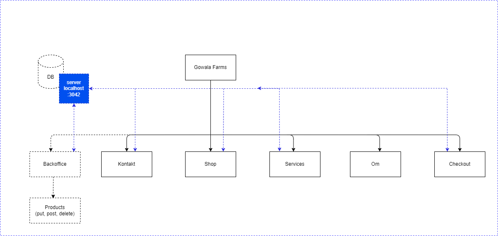

<div style="text-align: center; display: flex; justify-content: center; align-items: center; flex-direction: column; height: 30vh">

# FAGPRØVE

## April 2025

### Webudvikler-uddannelsen<br>Medieskolerne / Media College Denmark

</div>

<div style="page-break-after: always;"></div>

```

Project : Gowala Farms
Description : Kravspecifikation

```

# Gowala Farms

Et mobile First website

## Indledning

Gowala Farms – En familiedrevet gård- og mejeri i Australien har brug for en
hjemmeside og der er blevet lavet et udkast til design og oprettet et API

## Obligatoriske Opgaver.

1. Mobile first frontend i forhold til figma-designet.
2. Forside
   - Slider med 4 billeder
   - Visning af 4 tilfældige produkter fra api'et
   - Visning af de ansatte. Ved hover over navnet, åbnes en beskrivelse (som
     vist i designet)
   - Tilmelding til nyhedsbrev via api'et
3. Shop
   - Viser alle produkter hentet fra api
   - Filtreringsmulighed (alfabetisk rækkefølge)
4. Services
   - Artikler hentet fra api
5. Kontakt
   - Formular med validering der sender navn, email og beskrivelse til serveren
     samt modtager responset derfra.
6. Checkout
   - Oversigt over varerne i kurven
   - Mulighed for at øge/reducere antallet
7. Backoffice (Ikke mobil krav).
   - Produkter
     - Post, Put, Delete

## Minimum 1 Tilvalg

1. Responsive breakpoint > 1024px.
2. Backoffice
   - Messages (Vis de beskeder der er sendt via kontaktformularen)
     - Read/unread
3. Backoffice
   - Employees
     - Post, Put, Delete
4. Authentication
   - Sign In
5. Ordrer
   - Post ordrer til api'et fra checkout-siden

## Navigations Diagram



Du skal ikke følge denne slavisk men den er tilføjet for at illustrere
hensigten.

## Obligatoriske sider

1. "/"
2. "/shop"
3. "/contact"
4. "/services"
5. "/about"
6. "/checkout"
7. "/backoffice"
8. "/backoffice/products"

## Tilvalgs Sider

1. "/backoffice/orders"
2. "/backoffice/messages"

## Design Noter

**Design**

Du skal følge dette Figma-design:

- https://www.figma.com/design/sQUyEWg9LUfKO8PfUtYTvQ/Gowala-Farm?node-id=108-567&t=L07lrbpjTJXnyWkC-1

**Font**

1. Frank Ruhl Libre: https://fonts.google.com/specimen/Frank+Ruhl+Libre

## Rapport

**Rapporten skal indeholde:**

- Vurdering af din egen indsats og gennemførelse af prøven.
- Argumentation for de valg du har truffet under løsningen af opgaven.
- Redegørelse for oprindelsen af de forskellige kodeelementer i prøven.
- Beskrivelse af eventuelle særlige punkter til bedømmelse.
- Angivelse af url adresser, brugernavne og passwords der er nødvendige for at
  lærer og censor kan se opgaven. Hvis du bruger et agilt projektstyringsværktøj
  (SCRUM, Trello eller lign.) kan du med fordel indsætte et link til dit projekt
  i rapporten. Vi vil meget gerne se en daglig planlægning og eksekvering.

**På forsiden af rapporten skal fremgå:**

- Opgavens navn samt dit navn og holdnummer
- Brugernavn/adgangskoder

<div style="page-break-after: always;"></div>

## Retningslinjer

**Tidspunkt for udlevering**

Opgaven udleveres mandag d. 31/3 kl. 9.00.

**Tidspunkt for aflevering**

Din aflevering skal være afleveret fredag d. 4/4 kl. 20.00.

**Aflevering skal godkendes**

Din aflevering skal godkendes af din underviser.

**Aflevering skal indeholde**

1. Din kildekode (js, css, html, package.json, osv.), alt hvad du benytter for
   at lave projektet.
2. En instruktion i form af en readme.md, der beskriver hvad der skal til for at
   starte projektet.
3. En rapport. (pdf, eller .md (Mark Down)).

**Afleveringsformat**

1. Du kan aflevere det hele i en samlet zip fil uden ”node_modules”.
2. Du kan aflevere det hele som et GIT repositorie.

Tal med din underviser, og forbered gerne begge dele.

**Mundtlig eksamination**

Under eksaminationen skal du præsentere din opgaveløsning. Derudover skal du
kunne redegøre for enkeltelementer af løsningen - Dette kan være spørgsmål
omkring koder, valg af metodikker, navigationselementer, databaselayout eller
lignende. Udover projektopgaven kan øvrige emner, der relaterer sig til
uddannelsens fagområde indgå i eksaminationen.

**På dagen for eksamen**

På selve eksamensdagen ankommer du til skolen i god tid, før eksaminator og
censor har skuetid på din projektløsning. Projektet afvikles fra din egen
maskine, der bliver forbundet til en større skærm via HDMI (Tjek hjemmefra at
forbindelsen virker). Hvis ikke du medbringer strømforsyning, skal du sørge for
at maskinen er fuldt opladet og at den ikke låser med kode efter få minutter.
Fjern alt fra skrivebordet som er uvæsentlig for eksamen, og klargør programmer
og browser med projektet tændt. Du bliver inviteret ind i eksamenslokalet
kortvarigt for at opsætte din maskine, og skal derefter forlade lokalet under
skuetiden. Ved skuetids ophør bliver du hentet ind i lokalet igen, og skal
begynde din præsentation af projektet. Du har ca. 25 minutters eksamenstid,
hvorefter du skal forlade lokalet, mens eksaminator og censor voterer.
Slutteligt vil du blive kaldt ind i lokalet, og mundtligt få udleveret din
karakter samt en kort forklaring af karakteren. Utilfredshed med karakteren skal
ikke diskuteres ved overdragelsen af karakteren, men kan klargøres i en
skriftlig klage over karakteren eller formen ved eksamen eller karakterens
afgivelse.

**Klager**

Klager i forhold til eksamen modtages indtil 2 uger efter eksamenstidspunktet,
og kun i skriftlig begrundet form.
https://www.retsinformation.dk/eli/lta/2014/41#Kap10

**Vejledning**

Det er tilladt at kontakte undervisere i forbindelse med vejledning.
Undervisere, må ikke, i forbindelse med tvivl eller lign., aflevere løsninger
men må gerne vejlede.
